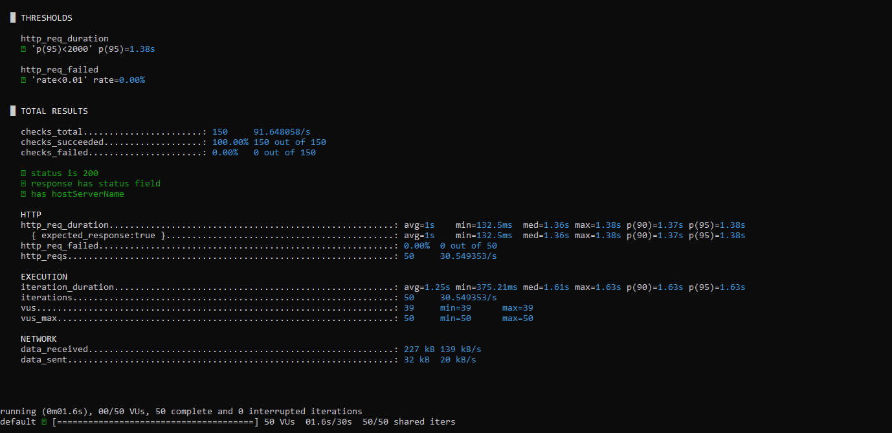

# API Performance, Load & Stress Testing — k6

[](https://github.com/AlAmin870/k6-api-performance-stress-testing/actions/workflows/k6.yml)

Performance tests written in **k6 (JavaScript)**. They check speed under load and also that the API still returns *correct* results under load, using business-rule checks and custom metrics. A smoke run executes on GitHub Actions on every push; load and stress profiles can be started manually from the Actions tab.

| Script | Target | Pattern |
|---|---|---|
| [`scripts/pizza_load_test.js`](scripts/pizza_load_test.js) | [QuickPizza](https://quickpizza.grafana.com), Grafana's public demo API | Smoke, load and stress profiles with ramping VUs |
| [`scripts/burst_test.js`](scripts/burst_test.js) | Private API (URL not published) | 50 VUs sending one request each at the same moment |

---

## 1. QuickPizza: load and stress profiles

A realistic user journey: browse toppings, request a pizza recommendation with random dietary restrictions, then wait 1 second (think time).

| Profile | Shape | Purpose |
|---|---|---|
| `smoke` (default, runs in CI) | 1 VU for 30 s | Script works and the API is up |
| `load` | Ramp to 20 VUs, hold 2 min, ramp down | Behaviour under expected traffic |
| `stress` | Step 25 → 50 → 100 VUs, holding 1 min at each step | Find where latency or errors start to climb |

**Thresholds (the run fails if any is breached)**

| Metric | Threshold |
|---|---|
| `http_req_failed` | < 1% |
| `http_req_duration{endpoint:toppings}` | p95 < 500 ms |
| `pizza_recommendation_duration` (custom Trend) | p95 < 1 s, p99 < 2 s |
| `pizza_rule_violations` (custom Rate) | 0%: a vegetarian request must never return meat |
| `checks` | > 99% pass |

### Run 2: `load` profile (20 VUs, 3 min)

Run from Dhaka against the public QuickPizza instance on 7 Oct 2026.

| Metric | Result | Threshold | |
|---|---|---|---|
| Requests / iterations | 3,308 / 1,654 | — | |
| Checks passed | 8,270 / 8,270 (100%) | > 99% | ✅ |
| Error rate | 0.00% | < 1% | ✅ |
| Vegetarian-rule violations | 0 | 0 | ✅ |
| Toppings p95 (median) | 1.26 s (249 ms) | p95 < 500 ms | ❌ |
| Recommendation p95 / p99 | 1.11 s / < 2 s | p95 < 1 s, p99 < 2 s | ❌ / ✅ |
| Max response time | 4.33 s | — | |

**Finding:** the API stayed **functionally correct** under load, with zero errors and zero business-rule violations, but **missed its latency targets**. The median stayed low (about 250 ms) while p95 rose about 5× above it, so most requests are fast and a minority are very slow. That pattern points to queuing or resource contention rather than slow code on every request. Some of the tail may be network latency from Bangladesh to the hosted demo, so the next step is to repeat the run near the server (or against a local QuickPizza container) to separate network time from server time.

The CI smoke run (1 VU) stays within all thresholds, so the badge reflects script health; the load result above is recorded by hand.

**Techniques used:** `ramping-vus` scenarios selected by an environment variable, `group()` per user step, per-endpoint tags so each endpoint gets its own threshold, custom `Trend` and `Rate` metrics, response-body validation, and `handleSummary()` exporting a JSON summary that CI uploads as an artifact.

---

## 2. Private API: burst test (Run 1)

50 virtual users each sent one request at the same moment (`shared-iterations`), to check the endpoint handles a sudden spike without errors.

| Metric | Result | Threshold |
|---|---|---|
| Requests | 50 | — |
| Checks passed | 150 / 150 (100%) | 100% |
| Error rate | 0.00% | < 1% |
| Avg / median response time | 1.00 s / 1.36 s | — |
| p95 response time | 1.38 s | < 2 s ✅ |

Checks: HTTP 200, `status` field equals `"Success"`, and `hostServerName` is present.

**Observation:** although all 50 requests arrived at once, they completed in three batches: 11 in 130–625 ms, 11 in 790–920 ms, and the remaining 28 in 1.18–1.38 s. All 50 were also served by the same backend host. Together that suggests requests queue behind a server-side concurrency limit rather than spreading across instances. The next step is a ramping test to find the VU count where queuing begins.



---

## Run

Install k6: <https://grafana.com/docs/k6/latest/set-up/install-k6/>

```bash
k6 run scripts/pizza_load_test.js                    # smoke
k6 run -e PROFILE=load scripts/pizza_load_test.js
k6 run -e PROFILE=stress scripts/pizza_load_test.js
k6 run -e TARGET_URL=https://your-api/endpoint scripts/burst_test.js
```

Create a `reports/` folder first if it doesn't exist; the JSON summary is written to it.

## Structure

```
├── scripts/
│   ├── pizza_load_test.js   # Smoke / load / stress profiles, custom metrics
│   └── burst_test.js        # 50-VU spike against a configurable endpoint
├── docs/run-1/              # Evidence from the private-API run
└── .github/workflows/k6.yml # Smoke on every push; load/stress on demand
```
